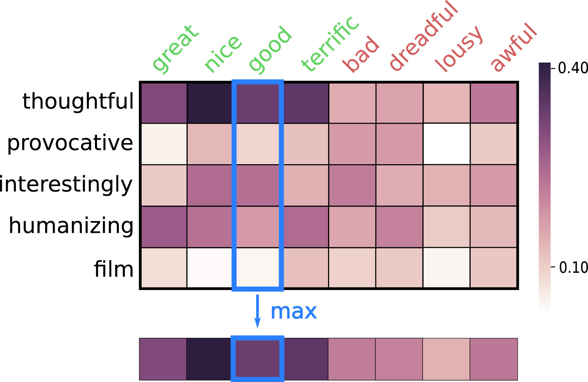

# Features

Feature extraction is of paramount importance in sentiment analysis and, more generally, Natural Language Processing.
_gsitk_ incorporates several utilities that implement a number of feature extraction techniques.
Some of these techniques have been recently published in peer-reviewed publications, and are oriented to foster research.

The list of feature extraction techniques implemented in _gsitk_ is:

* [`Word2VecFeatures`](#word2vecfeatures)
* [`Doc2VecFeatures`](#doc2vecfeatures)
* [`Simon`](#simon)
* [`SSWE`](#sswe)

Also, _gsitk_ allows the user to persist and load already extracted features.
This functionality is useful when a feature extraction process takes a long time, so you can persist the extracted features, for a posterior use.
For more on this, see [this section](#persist-and-load)

## Word2VecFeatures

This implementation corresponds to the M<sub>G</sub> presented in [Araque et al., 2017].
It uses a pre-trained word embedding model to extract a vector for each word, and then applies a pooling function to all words, obtaining document-level representation.
By default, the pooling function is the _average_.


The following example shows the use of the implementation:

```python
from gsitk.features.word2vec import Word2VecFeatures

text = [
    ['my', 'cat', 'is', 'totally', 'happy'],
    ['my', 'dog', 'is', 'very', 'sad'],
]

# path is set to a Word2Vec model
# convolution parameter encondes pooling operation [average, maximum, minimum]

w2v_extractor = Word2VecFeatures(
    w2v_model_path=path,
    w2v_format='google_txt',
    convolution=[1,0,0])
X = model.transform(text)
# X is and array containing extrated features
```

The parameters are configured as follows:

* `w2v_model_path`: must contain a string path to a pre-trained word embedding model.
* `w2v_format`: can be `gensim`, `google_txt`, `google_bin`, depending on the model's format. `gensim` is aimed to use [gensim models](https://radimrehurek.com/gensim/). `google_txt` and `google_bin` specify the use of the word2vec model for textual and binary representations, respectively.
* `convolution`: specifies the pooling function used. The coding is `[average, maximum, minimum]`. For example, `[1,0,0]` computes the average, `[1, 0, 1]` computes the average and minimum. 


## Doc2VecFeatures

Implementation of the method described in [Araque et al., 2017].
This offers a wrapper around the Doc2Vec model.
This implementation extracts a document-level representation by using word-level vectors and combining them.
As explained in the mentioned publication, using this rather that pure Word2Vec on long documents can improve results.
The use is straightforward:

```python
from gsitk.features.doc2vec import Doc2VecFeatures

text = [
    ['my', 'cat', 'is', 'totally', 'happy'],
    ['my', 'dog', 'is', 'very', 'sad'],
]

model = Doc2VecFeatures(path)
d2v_features = model.transform(text)
# this contains the vector representing each document
```

The parameter that is inserted into the `Doc2VecFeatures` is the path to the model.

## SIMON

This module implements the SIMilarity-based sentiment projectiON (SIMON) model, described in [Araque et al., 2019].
The main idea of the SIMON method is that given a domain lexicon, the input text is measured against it, computing a vector that encodes the similarity between the input text and the lexicon. Such a vector encodes the similarity, as given by the word embedding model, of each of the words of the analyzed text to the lexicon words.



To use SIMON, two things are needed:

* A sentiment lexicon
* A word embeddings model that is [_gensim_](https://radimrehurek.com/gensim/) compatible.

For example, using only the lexicon from [Bing Liu](https://dl.acm.org/citation.cfm?id=1014073) and a [embeddings model](https://code.google.com/archive/p/word2vec/) that is in the current directory:

```python
from gsitk.features import simon
from nltk.corpus import opinion_lexicon
from gensim.models.keyedvectors import KeyedVectors

lexicon = [list(opinion_lexicon.positive()), list(opinion_lexicon.negative())]

embedding_model = KeyedVectors.load_word2vec_format('GoogleNews-vectors-negative300.bin', binary=True)

simon_transformer = simon.Simon(lexicon=lexicon, n_lexicon_words=200, embedding=embedding_model)

# simon_transformer has the fit() and transform() methods, so it can be used in a Pipeline
```

The parameters that can be used are:

* `lexicon`: where we insert the domain lexicon we want to use.
* `n_lexicon_words`: the number of maximum number of words to use from the lexicon.
* `embedding`: expects a word embedding model.

This transformer implements the `fit` and `transform` methods from [scikit-learn API](https://scikit-learn.org/stable/modules/classes.html), which allows us to insert SIMON in a [Pipeline](https://scikit-learn.org/stable/modules/generated/sklearn.pipeline.Pipeline.html#sklearn.pipeline.Pipeline).
The previous use of SIMON is simple, and can be improved. 
To enhance performance, it is recommendable to use a more complete scikit-learn Pipeline that implements normalization and feature selection in conjuction with the SIMON feature extraction:

```python
from gsitk.features import simon

simon_model = simon.Simon(lexicon=lexicon, n_lexicon_words=200, embedding=embedding_model)
model = simon.simon_pipeline(simon_transformer=simon_model, percentile=25)

# model also implements fit() and transform()
```

In this expanded version, the new parameters are:

* `simon_transformer`: where a `Simon` transformer must be passed.
* `percentile`: percentile for the selection of features. 25 would be retaining the 25% most informative features. Specifying a 100 would retain all features, without performing any filtering.

## SSWE

This class implements the model and its exploitation as described in [this paper](https://doi.org/10.1016/j.eswa.2017.02.002) [Araque et al., 2017].
The original model is proposed in [this work](http://dx.doi.org/10.3115/v1/P14-1146) [Tang et al., 2014].
Basically, this implementation uses the already trained sentiment-aware word embeddings, extracting a vector for each document.
For this, it uses the sentiment-aware word embedding model, aggregating the component vectors into a document-level representation.
Its use can be seen in the example:

```python
from gsitk.features.sswe import SSWE

text = [
    ['my', 'cat', 'is', 'glad'],
    ['my', 'dog', 'is', 'saddening']
]

model = SSWE()
model.fit_transform(text)
```

```python
# output
array([[-0.03692475,  0.69433968, -0.10123377, -0.20750073, -0.4521742 ,
        -0.11163325, -0.6230624 , -0.31017193,  0.5679557 ,  0.27609493,
        -0.30070497, -0.20598209,  0.62151025, -0.10289793,  0.0028881 ,
        -0.64963145, -0.2537114 , -0.10160725, -0.13404223,  0.21716036,
         0.1927223 ,  0.33401577, -0.09717232, -0.47497711,  0.24664997,
         0.12755613, -0.15305273, -0.22193395, -0.01209228,  0.05324505,
         0.43930245,  0.00602835, -0.30367692, -0.70815245, -0.79096279,
         0.10255207, -0.07759673,  0.40358937, -0.10322898,  0.44279148,
         0.82335535,  0.31171023,  0.44288205,  0.2905347 ,  0.46477   ,
         0.28904402, -0.55061338,  0.10661928,  0.46488735,  0.33304884],
       [-0.36602225, -0.58546405,  0.05227629, -0.21769451,  0.01021858,
         0.8831138 ,  0.19209097, -0.01067718, -0.34836705, -0.0732986 ,
        -0.69389325,  0.00714602, -0.1676837 ,  0.23442017, -0.388703  ,
         0.75398148,  0.51507288,  0.15459292,  0.322662  ,  0.18878383,
         0.3826721 , -0.09494013, -0.24824411, -0.07548841,  0.1644036 ,
         0.2624967 ,  0.20364558, -0.40885403, -0.2868039 ,  0.6564402 ,
         0.16390643, -0.35993635, -0.07133374, -0.2713782 ,  0.6116734 ,
         0.02168057, -0.2557114 ,  0.40677885,  0.35998122,  0.30713927,
        -0.62793042, -0.52468092,  0.01578745, -0.08235615,  0.06924792,
        -0.61774441,  0.78259982, -0.61167277, -0.21632402, -0.31093053]])
```


## Persist and load

Saving an already extracted feature set to load it later is very useful.
There are times when extracting features takes a long time, and we need to persist those valuable features to disk.
For this, use the persistence utility in _gistk_.
See the example:

```python
# we have already loaded a built-in dataset: imdb

from gsitk.features import features

w2v_feat = Word2VecFeatures(w2v_model_path='/data/w2vmodel_500d_5mc')

# this can take a long time
transformed = w2v_feat.transform(data['imdb']['text'].values)
# transformed.shape has (50000, 500) dimensions

# we name the features for posterior recovery
features.save_features(transformed, 'w2v__sentiment')

```

```python
# we load it later
my_feats = features.load_features('w2v__sentiment')
# my_feats has (50000, 500) dimensions
```

---

[Araque et al., 2017]
Oscar Araque, Ignacio Corcuera-Platas, J. Fernando Sánchez-Rada, Carlos A. Iglesias. Enhancing deep learning sentiment analysis with ensemble techniques in social applications, Expert Systems with Applications, Volume 77, 2017, Pages 236-246, ISSN 0957-4174, [https://doi.org/10.1016/j.eswa.2017.02.002](https://doi.org/10.1016/j.eswa.2017.02.002)

[Araque et al., 2019]
Oscar Araque, Ganggao Zhu, Carlos A. Iglesias. A semantic similarity-based perspective of affect lexicons for sentiment analysis, Knowledge-Based Systems, Volume 165, 2019, Pages 346-359, ISSN 0950-7051, [https://doi.org/10.1016/j.knosys.2018.12.005](https://doi.org/10.1016/j.knosys.2018.12.005).

[Tang et al., 2014]
Tang, D., Wei, F., Yang, N., Zhou, M., Liu, T., & Qin, B. (2014, June). Learning sentiment-specific word embedding for twitter sentiment classification. In Proceedings of the 52nd Annual Meeting of the Association for Computational Linguistics (Volume 1: Long Papers) (pp. 1555-1565).
